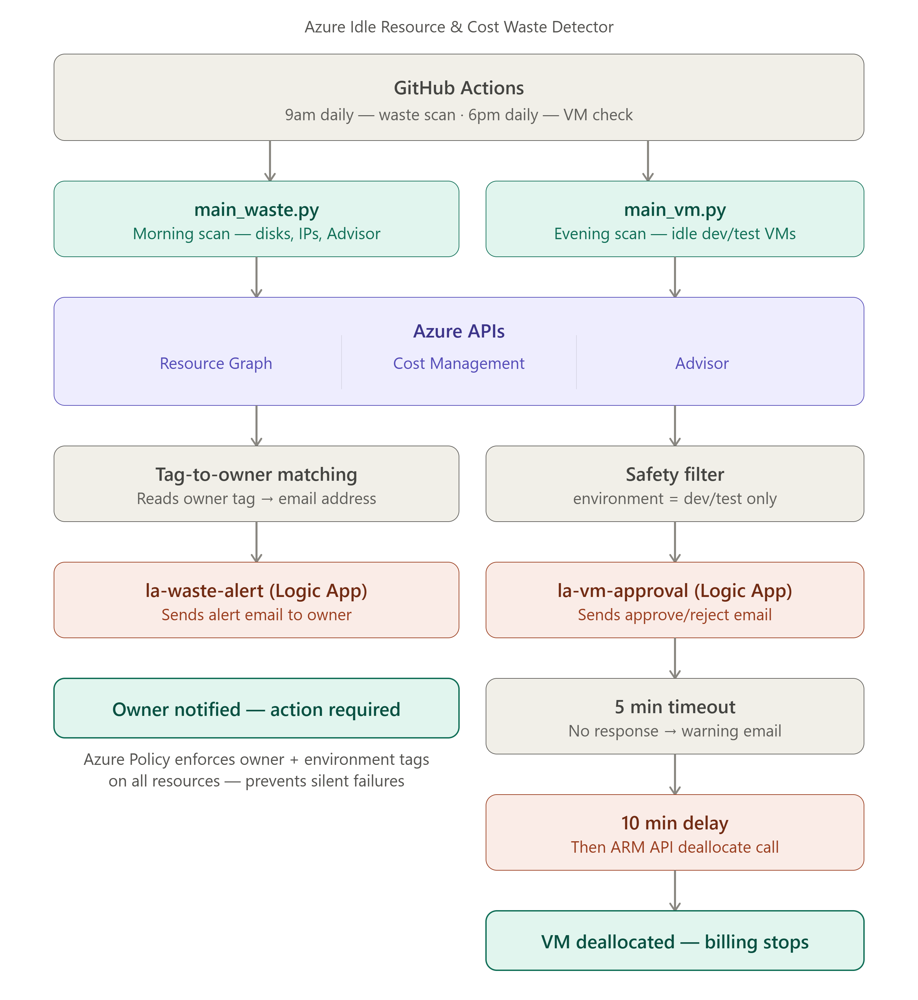

# Azure Idle Resource & Cost Waste Detector

## The Problem
Companies waste an average of 32% of their Azure cloud spend 
on resources nobody remembered to clean up — unattached disks, 
orphaned public IPs, and dev/test VMs running 24/7. Azure's 
native tools (Advisor, Cost Management) detect waste but leave 
it sitting in a portal dashboard nobody checks consistently. 
The deeper gap: when waste is flagged, there's no way to 
automatically route it to the person responsible.

## What This Solves
An automated scanner that:
- Detects orphaned disks, orphaned public IPs, and idle 
  dev/test VMs across an Azure subscription
- Matches each wasteful resource to its owner via resource tags
- Routes targeted email alerts to the right person automatically
- Sends a human-in-the-loop approval email before shutting 
  down any VM — owner has 5 minutes to respond
- Deallocates unresponded VMs automatically via Logic Apps
- Runs on a schedule via GitHub Actions — no manual execution

## Architecture

## Tech Stack
- Python (Azure SDK) — resource scanning and API integration
- Azure Resource Graph API — subscription-wide resource queries
- Azure Cost Management API — cost data per resource
- Azure Advisor API — native waste recommendations
- Azure Policy — enforces mandatory owner/environment tags
- Logic Apps — email alerts and VM approval workflow
- GitHub Actions — scheduled automation (9am waste scan, 
  6pm VM check)

## Key Design Decisions

**Why not just use Azure Advisor?**
Advisor detects waste but it sits in the portal waiting 
to be checked. Nobody checks it consistently — which is 
exactly why the 32% waste stat exists even at companies 
that have Advisor enabled. This tool pushes findings to 
the resource owner automatically instead of waiting for 
someone to log in.

**Why resource tags for owner routing?**
Azure's native alerting can email a static address but 
can't route to a specific owner per resource. Tags give 
us the owner-to-resource mapping that makes targeted 
alerts possible.

**Why Logic Apps for the VM approval flow?**
Logic Apps has a built-in approval email connector with 
Approve/Reject buttons and configurable timeout. This 
gave me human-in-the-loop control without building a 
custom polling system — and the managed identity 
integration means no credentials stored anywhere in code.

**Why separate 9am and 6pm workflows?**
Orphaned resource alerts are useful at the start of 
the workday. VM idle detection only makes sense after 
business hours. Running both at the wrong time would 
either miss detections or send alerts when nobody's 
watching.

## What Broke During the Build

**False positive on active OS disk:** The scanner initially 
flagged VM1's active OS disk as orphaned. Root cause: I was 
checking the `managedBy` field inside `properties` instead 
of at the resource's top level — two different locations in 
the Azure Resource Graph response. In production, this false 
positive could have triggered an accidental VM shutdown. 
Fixed by correcting the field path and adding the 
`environment:dev/test` safety filter so the runbook never 
touches production resources regardless.

**Invisible trailing spaces in tag keys:** Tags set via 
the Azure portal were returning as `'environment  '` 
(with trailing spaces) from the Resource Graph API, 
causing all environment tag lookups to return 'unknown'. 
Fixed with `.strip().lower()` normalization on all tag 
keys before any comparison.

## What I'd Add for Production
- **Azure Key Vault** instead of environment variables 
  for storing Logic App URLs and service principal secrets
- **Grafana dashboard** connected to Log Analytics showing 
  waste trends over time — cost saved per week, most common 
  waste type, owner leaderboard
- **Tag enforcement remediation** — currently Azure Policy 
  denies untagged resources but doesn't retroactively fix 
  existing ones. A remediation task with managed identity 
  would handle resources created before the policy existed
- **Azure Communication Services** instead of Gmail connector 
  — prevents spam filtering and supports verified sender domains
- **Multi-subscription support** — currently scoped to one 
  subscription; Resource Graph supports cross-subscription 
  queries with minor changes

## Weekly Build Progress
- [x] Week 1 — Environment setup, tagging governance, 
      Azure Policy enforcement
- [x] Week 2 — Data collection layer (Resource Graph, 
      Cost Management, Advisor APIs)
- [x] Week 3 — Owner-matched email alerts via Logic Apps
- [x] Week 4 — VM approval flow and automated shutdown
- [x] Week 5 — GitHub Actions scheduled automation, 
      case study documentation

## Author
Ashen Ellawala
BICT (Network Technology) — University of Kelaniya
AZ-900 Certified | Azure Cloud & DevOps Portfolio

## Scheduling Architecture

Two scheduling mechanisms implemented:

**Current (GitHub Actions):** Runs daily with variable 
timing due to free tier queue delays of 15-60 minutes.

**Production Design (Azure Functions Timer Trigger):** 
Implemented and tested locally. Fires at exactly 6pm 
Sri Lanka time daily on Azure's dedicated infrastructure 
with zero delay. Deployment requires paid subscription 
— student subscription network restrictions blocked 
the final deployment step.

## Lessons Learned

- GitHub Actions free tier schedules are best-effort — 
  not suitable for time-critical production automation
- Azure Functions timer triggers run on dedicated 
  infrastructure with exact timing guarantees
- Student subscription regional restrictions affected 
  both Azure Automation and Function App deployment — 
  documented as known limitation
- False positives in automated systems can cause real 
  damage — the environment tag safety filter and 
  human approval step exist specifically to prevent this